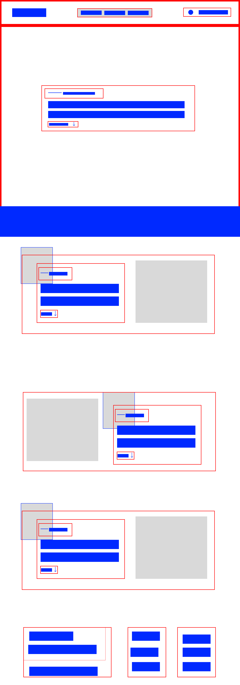

# ThePower - Entrega Flexbox

El objetivo de la siguiente entrega es poner en práctica los conceptos aprendidos de Flexbox. En este caso se han tenido en cuenta los siguientes puntos:

 1. Aprovechar la oportunidad para generar un acabado lo más fiel posible.
 2. Generar un código limpio y escalable.
 3. Mejorar las técnicas de uso de media querys y el diseño responsive.

## Fase 1 - Preparaciones
Para comenzar, se ha seleccionado replicar el diseño de Kryston Schwarze de MNTN, una landing sobre senderismo.

En primer lugar antes de comenzar el proyecto se ha realizado un esquema visual del los posibles contenedores necesarios para realizar el proyecto

<h3 style="
border-bottom: .1px solid;
padding-bottom:8px;">Layout</h3>

En primer lugar, se ha simulado el desarrollo de las cajas necesarias en Figma para jerarquizar la información simplificando el proceso de desarrollo.

## Fase 2 - Desarrollo

Para el desarrollo se ha propuesto una metodología "de fuera hacia dentro" no solo atacando a los contenedores más grande hasta los pequeños detalles, sino que además se han estructurado los estilos siguiendo la misma metodología, empezando por:

1. Displays.
2. Posiciones.
3. Tamaños.
4. Márgenes.
5. Paddings.
6. Estilos de los elementos siguiendo un órden lógico.

